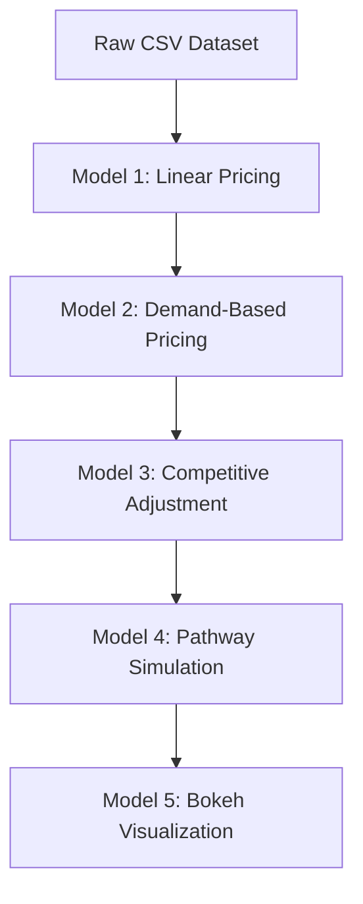

# Dynamic-pricing-parking
🚗 Dynamic pricing engine for urban parking lots using Python, Pathway &amp; Bokeh. Built by Mohit Upadhyay for Summer Analytics 2025 by Consulting &amp; Analytics Club × Pathway.

This project demonstrates dynamic pricing using occupancy data, demand features, competitor context, and live simulation using Pathway & Bokeh.

---

## 📌 Objective

Urban parking is often underpriced or overpriced due to static pricing systems. This project aims to:

- Design dynamic pricing models using real-world features
- Simulate pricing in real-time
- Visualize prices across parking lots
- Make pricing reactive to competition and demand

---

## 🧰 Tech Stack Used

- **Python** (Pandas, NumPy, Matplotlib)
- **Pathway** for real-time stream simulation
- **Bokeh** for live visualization
- **Google Colab** for development
- **GitHub** for version control

---


## 📁 Folder Structure

```
Dynamic-Pricing-Urban-Parking/
├── dataset.csv‎
├── Dynamic_Pricing_Model_(Final).ipynb‎
├── README.md‎
├── Model 1.png
├── Model 2.png
├── Model 3.png
├── Model 5.png
```

---

## 🧠 Models Implemented

### ✅ Model 1: Linear Pricing Based on Occupancy

Price increases proportionally with occupancy using a basic formula:

\[
\text{Price} = \text{Base} + \alpha \cdot \left( \frac{\text{Occupancy}}{\text{Capacity}} \right)
\]

- Base Price = $10  
- Alpha (α) = 1.0  
- Capped between $5 and $20

📊 **Output Plot**  


---

### ✅ Model 2: Demand-Based Pricing

Incorporates real-world demand signals:
- Occupancy rate
- Queue length
- Traffic condition nearby
- Is it a special day?
- Vehicle type (bike/car/truck)

\[
\text{Final Price} = \text{Base} \cdot \left(1 + \lambda \cdot \text{NormalizedDemand} \right)
\]

- Lambda (λ) = 0.8  
- Price clipped between $5 and $20

📊 **Output Plot**  


---

### ✅ Model 3: Competitive Pricing Adjustment

Accounts for pricing of nearby competitors using geolocation (lat/lon) and the **Haversine distance formula**.

Logic:
- If nearby lots are cheaper → reduce your price
- If you're cheaper or isolated → slight increase
- Radius used: 1 km

📊 **Output Plot**  


---

### ✅ Model 4: Real-Time Simulation with Pathway

We simulate a live stream of parking data using Pathway by:
- Streaming 100 rows of data
- Applying a custom `@pw.udf` to compute real-time price
- Outputting to the notebook with `pw.debug.compute_and_print(...)`

🧪 Stream sample generated from: `dataset.csv`

---

### ✅ Model 5: Bokeh Interactive Visualization

Used Bokeh to create an interactive line plot of Model 2 prices across 50 parking lots. Ideal for real-time dashboards.

📊 **Plot Screenshot**  


---

## 🏗️ Architecture Diagram



### How to Run
```
Open Dynamic_Pricing_Model_(Final).ipynb in Google Colab

Run the notebook top to bottom

All 5 models, markdown, and plots are included

Plots are saved as images and used in this README

```
## ✍️ Author
Authored by Mohit Upadhyay for Summer Analytics 2025

## ⚖️ License
MIT License

